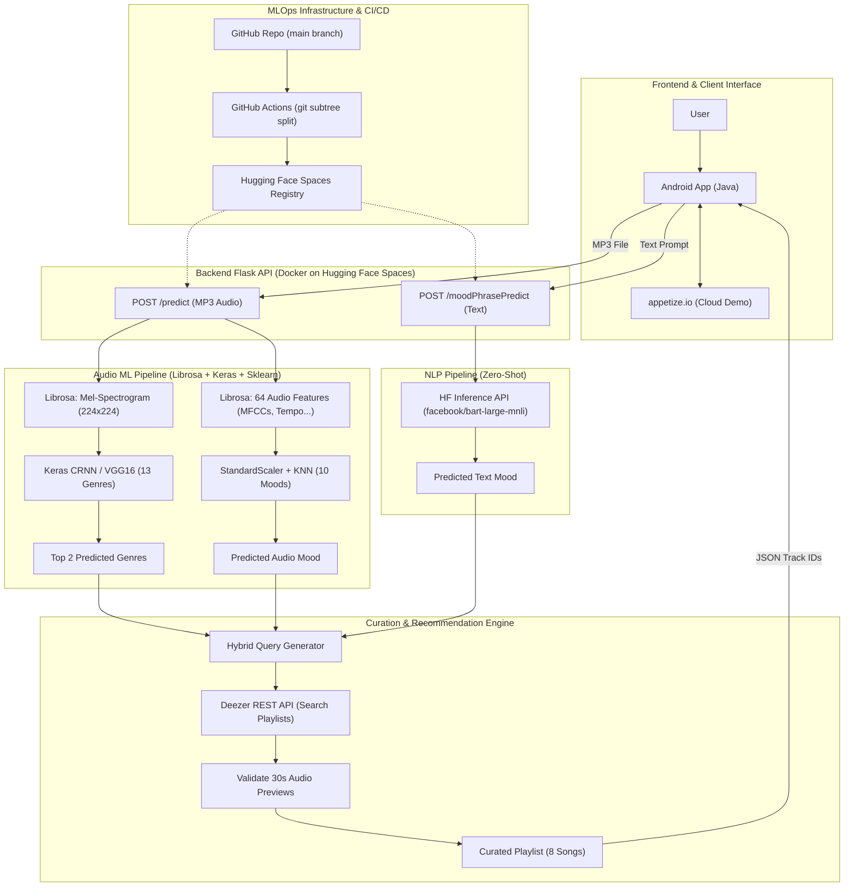

# 📁 SYSTEM DESIGN & TECHNICAL MASTER CHEATSHEET: AI PLAYLIST CURATION (ARTISHOW)
> **Mistral AI Interview Preparation Guide — Forward Deployed ML Engineer (FD-MLE)**

---

## 📌 Executive Summary
**AI Playlist Curation (Artishow)** is an end-to-end multi-modal music recommendation platform developed at **Télécom Paris** (awarded **Top 5 Jury Favorite** at the Project Showcase). 

Moving beyond an offline Jupyter Notebook, this project implements a production-grade software & MLOps engineering lifecycle:
* **Multi-Modal AI Inference:** Combines **Audio-to-Vision CRNN (VGG16)** for genre classification, **Tabular Audio Feature Engineering (64-dim Librosa features + KNN)** for audio mood classification, and **Zero-Shot NLP (BART-Large-MNLI)** for text-based mood prompts.
* **Algorithmic Curation Engine:** A hybrid search & fallback engine that queries the **Deezer REST API**, filters active 30-second previews, and builds randomized, balanced 8-track playlists.
* **Production MLOps Infrastructure:** Containerized Flask API (`python:3.12-slim` + `tensorflow-cpu`), continuous deployment via **GitHub Actions** (`git subtree split`), hosted on **Hugging Face Spaces**.
* **Client Frontend:** Native Android Application (Java) hosted on **Appetize.io** cloud emulator for zero-install live testing.

---

## 🌐 1. System Design Architecture

### 🔷 Universal Visual Diagram (ASCII / Text)

```text
                                   ┌────────────────────────────────────────────────────────┐
                                   │               📱 FRONTEND / CLIENT LAYER               │
                                   │ [ 👤 User ] ──► [ 📱 Android Java App ] ◄──► Appetize  │
                                   └───────────────────────────┬────────────────────────────┘
                                                               │
                                         ┌─────────────────────┴──────────────────────┐
                                         │   HTTP REST Requests (MP3 Audio or Text)   │
                                         ▼                                            ▼
                    ┌──────────────────────────────────────────┐  ┌──────────────────────────────────────────┐
                    │ ⚡ ENDPOINT 1: POST /predict (MP3 File)   │  │ ⚡ ENDPOINT 2: POST /moodPhrasePredict   │
                    └────────────────────┬─────────────────────┘  └────────────────────┬─────────────────────┘
                                         │                                             │
                          ┌──────────────┴──────────────┐                              │
                          ▼                             ▼                              │
          ┌───────────────────────────┐ ┌───────────────────────────┐         │
          │  Librosa Mel-Spectrogram  │ │ 64 Audio Features Extracted│         │
          │  (224x224 RGB - Magma dB) │ │  (MFCCs, Tempo, Tonnetz)  │         │
          └─────────────┬─────────────┘ └─────────────┬─────────────┘         │
                        ▼                             ▼                       │
          ┌───────────────────────────┐ ┌───────────────────────────┐         ▼
          │ Keras CRNN (VGG16 Model)  │ │ StandardScaler + KNN Model│ ┌───────────────────────────┐
          │   (13 Audio Genres)       │ │     (10 Audio Moods)      │ │ HF Inference API (ZeroShot)│
          └─────────────┬─────────────┘ └─────────────┬─────────────┘ │ (bart-large-mnli NLI NLP) │
                        ▼                             ▼               └─────────────┬─────────────┘
                [ Top 2 Genres ]               [ Audio Mood ]                       ▼
                        │                             │                      [ Text Mood ]
                        └──────────────┬──────────────┘                             │
                                       ▼                                            │
    ┌───────────────────────────────────────────────────────────────────────────────┴─────────────────┐
    │                        🎶 CURATION & RECOMMENDATION ENGINE                                      │
    │  1. Hybrid Query Builder: "{genre1} {mood}" & "{genre2} {mood}"                                │
    │  2. Interrogate Deezer REST API (Search Playlists, fetch 50 tracks, validate 30s previews)      │
    │  3. Interleaving, Fallbacks & Random Shuffle (8 Tracks Output)                                  │
    └──────────────────────────────────────────┬──────────────────────────────────────────────────────┘
                                               │
                                               ▼
                            [ 📱 Return JSON Payload (Track IDs) to App ]

    ┌─────────────────────────────────────────────────────────────────────────────────────────────────┐
    │                                🔄 MLOPS & CI/CD PIPELINE                                        │
    │   [ 🐙 GitHub Repo (main) ] ──► [ ⚙️ GitHub Actions ] ──► [ 🤖 Hugging Face Spaces ]             │
    │                                 (git subtree split)         (Auto Docker Deployment)            │
    └─────────────────────────────────────────────────────────────────────────────────────────────────┘
```

### 🔷 Mermaid Flowchart Diagram



---

## 🧠 2. Deep Technical Breakdown: Machine Learning & NLP Pipelines

### 🅰️ Genre Classification: Audio Spectrogram Vision (CRNN / VGG16)
* **Mathematical Concept:** Converts 1D time-domain audio signals into 2D time-frequency representations (Mel-Spectrograms) and frames classification as a Computer Vision task.
* **Audio Preprocessing (`CnnClassification.py`):**
  * **Sampling Rate ($f_s$):** `22,050 Hz`.
  * **Duration:** Fixed to `30 seconds` ($N = 22050 \times 30 = 661,500$ samples). Short audio clips are padded (`np.pad` with `mode='wrap'`), long clips are truncated.
  * **Mel-Spectrogram Computation:** `n_mels = 224`, `hop_length = 512`.
  * **Decibel Scaling:** $S_{dB} = 10 \cdot \log_{10} \left( \frac{S}{\max(S)} \right)$ via `librosa.power_to_db`.
  * **Image Export:** Rendered as a `224x224` pixel RGB image with `dpi=100` and `cmap='magma'`.
* **Model Architecture & Inference:**
  * **Backbone:** Deep Convolutional Neural Network (VGG16-inspired architecture) trained in Keras (`modele_crnn_hd_final_13genres.keras`).
  * **Classes (13 Genres):** *blues, classical, country, disco, hiphop, jazz, metal, pop, reggae, rock, etc.*
  * **Multi-Genre Prediction Strategy:** Rather than selecting only the argmax, `np.argsort(predCnn[0])[-2:][::-1]` extracts the **top 2 predicted genres** (`genre1`, `genre2`) to handle hybrid styles (e.g., *Pop/Rock* or *Hip-Hop/Reggae*).

---

### 🅱️ Audio Mood Classification: 64-Dimensional Feature Vector + KNN
* **Feature Engineering (`GenreMoodClassification.py`):**
  Extracts 10 distinct acoustic descriptors from the 30s audio signal. For each descriptor (except Tempo), both the **Mean** ($\mu$) and **Standard Deviation** ($\sigma$) across time frames are computed to form a **64-dimensional feature vector**:

| Acoustic Feature | Description | Dimensions ($\mu + \sigma$) |
| :--- | :--- | :---: |
| **MFCCs (13 coefficients)** | Spectral envelope & timbre representation | $13 \times 2 = 26$ |
| **RMS Energy** | Audio energy / volume dynamics | $1 \times 2 = 2$ |
| **Spectral Centroid** | Brightness / center of mass of spectrum | $1 \times 2 = 2$ |
| **Spectral Bandwidth** | Width of frequency band | $1 \times 2 = 2$ |
| **Spectral Contrast** | Difference between peaks and valleys (6 sub-bands) | $6 \times 2 = 12$ |
| **Spectral Flatness** | Measure of noise vs. tonal structure | $1 \times 2 = 2$ |
| **Spectral Rolloff** | Frequency below which 85% of power resides | $1 \times 2 = 2$ |
| **Tonnetz** | Harmonic centroid features (pitch class space) | $6 \times 2 = 12$ |
| **Zero-Crossing Rate** | Rate of sign changes in time domain | $1 \times 2 = 2$ |
| **Tempo (BPM)** | Beat tracking via `librosa.beat.beat_track` | $1$ |
| **TOTAL** | | **64 features** |

* **Tabular Model Stack:**
  * **StandardScaler:** Normalizes features to zero mean and unit variance (`scaler (1).pkl`).
  * **K-Nearest Neighbors Classifier:** `knn_model_mood (1).pkl`.
  * **10 Mood Classes:** *dark, deep, dream, emotional, epic, happy, motivational, relaxing, romantic, sad*.

---

### Ⓒ Text Mood Classification: Zero-Shot NLI (`phraseMood.py`)
* **Endpoint:** `/moodPhrasePredict`
* **Model:** `facebook/bart-large-mnli` (BART large model fine-tuned on Multi-Genre NLI).
* **Execution:** Hosted on Hugging Face Inference API. The user text prompt (e.g., *"I had a long exhausting day, need to chill"*) is evaluated against the 10 candidate mood labels in zero-shot fashion without task-specific fine-tuning.

---

## 🎶 3. Algorithmic Curation & Playlist Generator Engine

The curation engine (`playlistGeneration.py`) transforms ML class predictions into playable music playlists:

```text
Genre 1: "rock" ──┐
Genre 2: "pop"  ──┼──► Query Builder ──► Deezer REST API ──► Track Filter ──► 8-Track Playlist
Mood: "happy"   ──┘
```

1. **Hybrid Query Generation (`playlist_generator_music`):**
   * **Primary Query:** `"{genre1} {mood}"` ➔ Requests 4 tracks from Deezer.
   * **Secondary Query:** `"{genre2} {mood}"` ➔ Requests 4 tracks from Deezer.
   * **Fallback Strategy:** If `genre2` is missing or identical to `genre1`, switches to `"{mood} vibe"`. If total tracks < 8, fills remaining slots with `"Best of {genre1}"`.
2. **Deezer API Search & Playlist Randomization (`fetch_tracks_from_deezer_query`):**
   * Queries Deezer Playlist Search API (`https://api.deezer.com/search/playlist`).
   * Fetches top 15 matching playlists, filters out playlists with $\le 5$ tracks, and **randomly picks one valid playlist** (`random.choice`).
3. **Stream Verification & Shuffling:**
   * Fetches up to 50 tracks from the selected playlist.
   * Validates that each track has an active 30-second audio stream preview (`t['preview']`) and is playable (`t['readable']`).
   * Shuffles the final list (`random.shuffle`) to interleave primary and secondary genres.

---

## 🛠️ 4. Software Engineering, MLOps & Infrastructure

```text
[ Git Push main ] ──► [ GitHub Actions Workflow ] ──► [ git subtree split ] ──► [ Hugging Face Spaces Docker ]
```

* **Backend Server (`api.py`):**
  * Flask REST API exposing port `7860` (Hugging Face Spaces standard port).
  * Multipart file handler for audio uploads, using `uuid.uuid4().hex` for isolated temporary disk file processing in `uploads/` and `images/`.
* **Docker Containerization (`Dockerfile`):**
  * Base Image: `python:3.12-slim`.
  * System Dependencies: `libsndfile1` (C library for soundfile decoding) and `ffmpeg` (MP3 audio decoding).
  * Optimization: Installs `tensorflow-cpu` to reduce image size and memory footprint.
* **Continuous Deployment CI/CD (`.github/workflows/sync_huggingface.yml`):**
  * GitHub Actions workflow listening to `push` on `main`.
  * Executes: `git push space $(git subtree split --prefix artishow-api main):main --force`.
  * Decouples the monorepo, deploying only the `artishow-api` directory directly to Hugging Face Spaces.
* **Frontend & Demo Infrastructure (`java-app`):**
  * Native Android Java application.
  * Integrated with **Appetize.io** cloud browser emulator, allowing instant interactive testing during jury presentations without installing an APK.

---

## 🎯 5. Technical Interview FAQ & Trade-off Analysis (Mistral AI FD-MLE Focus)

### Q1: "Why convert audio into 2D PNG images on disk for a 2D CNN instead of passing raw spectrogram matrices in memory?"
> **FD-MLE Answer:**  
> *"In our initial MVP stage, exporting Mel-spectrograms as PNG images allowed us to leverage pre-trained Computer Vision backbones (VGG16) and visually debug frequency representation using Matplotlib. However, writing and reading PNGs introduces disk I/O bottlenecks. In a production system at scale, we would pass raw 2D `float32` numpy/PyTorch tensors directly in memory (`io.BytesIO` or GPU memory buffers), bypassing disk serialization entirely."*

### Q2: "How would you optimize inference latency and scale this architecture to 100,000 requests/sec?"
> **FD-MLE Answer:**  
> *"1) **Model Acceleration:** Convert TensorFlow/Keras models to **ONNX Runtime** or **Triton Inference Server** with CPU quantization (INT8/FP16), cutting latency by 3-5x.*  
> *2) **Vector Embedding Search:** Replace live Deezer API searching with an offline vector database (e.g., Qdrant or Milvus) storing pre-computed audio embeddings (CLAP or MusiCNN), enabling sub-10ms nearest-neighbor music retrieval.*  
> *3) **Async Queue Architecture:** Offload heavy audio processing to an asynchronous task queue (Celery + Redis/RabbitMQ) with WebSocket notifications to the client."*

### Q3: "As a Project Manager, how did you drive technical architecture decisions?"
> **FD-MLE Answer:**  
> *"I acted as the bridge between ML research and software engineering. I defined the REST API contract (`POST /predict`), designed fallback strategies for API rate-limits/missing previews, and implemented the GitHub Actions MLOps pipeline. This enabled our ML developers and Android developer to build and test independently without integration blocks."*

---

## 🏆 6. Behavioral STAR Framework (Mistral AI Interview Prep)

### 🥇 Story 1: Proud Technical Project (End-to-End Delivery & Ownership)
* **Situation:** 1st-year project at Télécom Paris. Most student projects remain isolated in Jupyter Notebooks. I wanted to build a complete, production-ready product.
* **Task:** As Project Manager and technical lead, my goal was to design the system architecture and lead the team to deliver an end-to-end platform (ML Models + Docker + API + Android UI).
* **Action:** 
  1. Engineered a multi-modal ML pipeline (CNN audio vision + KNN tabular audio features + Zero-Shot NLP).
  2. Implemented MLOps automation using Docker and GitHub Actions (`git subtree split` to Hugging Face Spaces).
  3. Integrated Appetize.io for live browser testing and conducted extensive user feedback sessions.
* **Result:** Awarded **Top 5 Jury Favorite** at Télécom Paris Showcase; received strong user adoption for playlist quality.

### 🥈 Story 2: Self-Learning & Curiosity (Fast Learning & Problem Solving)
* **Situation:** Started this project in 1st year prior to taking any formal academic courses in Machine Learning or Deep Learning.
* **Task:** Rapidly master audio signal processing, feature engineering, and neural network architectures on a tight deadline.
* **Action:** 
  1. Autonomously studied research papers on Mel-spectrogram analysis, Librosa documentation, and deep learning courses.
  2. Applied *learning-by-doing*: prototyped baseline classifiers (Random Forest, SVM), transitioned to CNNs (VGG16) and ensemble methods, and extracted 64-dim acoustic feature vectors.
  3. Knowledge-shared learnings with team members to align software engineering with ML capabilities.
* **Result:** Built a robust multi-model classification pipeline from scratch and proved ability to quickly master complex technical domains independently.
